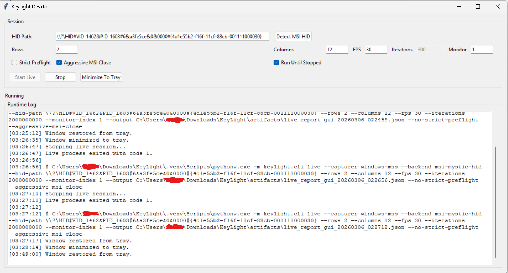
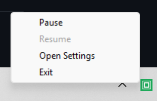
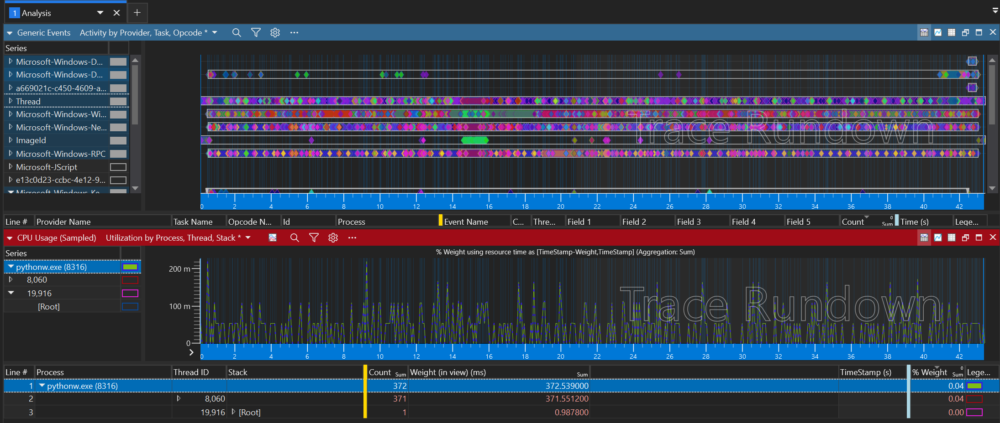

# KeyLight

KeyLight is a Windows-first RGB sync app that maps screen colors to keyboard lighting zones in real time.

Preview : 


Settings Interface :



Default Tray View : 



wpa 



Initial target hardware:
- MSI Vector 16 HX AI A2XW
- 24-zone RGB keyboard

## Current Status

This repository is now prepared with:
- clean Python project structure (`src/`, `tests/`, `docs/`, `scripts/`)
- core domain + pipeline skeleton
- pluggable interfaces for capture, mapping, and keyboard drivers
- a simulator path so algorithm work can start before hardware integration

## Project Layout

```text
src/keylight/
  capture/      # Screen frame sources (mock + future Windows capture backends)
  drivers/      # Keyboard lighting drivers (simulated + future hardware backends)
  mapping/      # Frame-to-zone mapping algorithms (grid + calibrated profile)
  contracts.py  # Core interfaces
  models.py     # Domain models
  pipeline.py   # Runtime orchestration
  cli.py        # CLI entrypoint
tests/          # Unit tests
docs/           # Architecture, roadmap, hardware notes
scripts/        # Local dev helper scripts
```

## Quick Start (PowerShell)

```powershell
.\scripts\bootstrap.ps1 -WithHardware $true -WithCapture $true
.\scripts\preflight.ps1
.\scripts\check.ps1
.\scripts\longrun.ps1 -DurationHours 8 -RunReadinessCheck -RunPreflightBeforeReadiness -PreflightStrictForReadiness -PreflightAggressiveMsiCloseForReadiness -RequireHardwareBackend -RequireCalibratedMapper -RequireCalibrationProfile -RequireCalibrationProfileGeneratedTimestamp -RequireCalibrationProfileProvenance -RequireCalibrationProfileProvenanceWorkflowMatch -MaxCalibrationProfileAgeSeconds 3600 -RequireCalibrationWorkflow -RequireCalibrationVerifyExecuted -RequireCalibrationLiveVerifyExecuted -RequireCalibrationLiveVerifySuccess -CalibrationWorkflowReport artifacts/calibrate_report_final.json -MaxCalibrationWorkflowAgeSeconds 3600 -ForbidIdentityCalibration -RequirePreflightCleanForReadiness -RequirePreflightAdminForReadiness -RequirePreflightStrictModeForReadiness -RequirePreflightAccessDeniedClearForReadiness -StrictPreflight -RestoreOnExit -RestoreColor "0,0,0" -MinEffectiveFps 20 -MaxOverrunPercent 25
.\scripts\finalize-hardware.ps1 -Backend msi-mystic-hid -HidPath "<PATH>" -TemplateOnly
.\scripts\finalize-hardware.ps1 -Backend msi-mystic-hid -HidPath "<PATH>" -ObservedOrderFile artifacts/observed_order_template_filled.txt -RunStrictReadiness -ReadinessRunPreflight -ReadinessPreflightAggressiveMsiClose
python -m keylight.cli --iterations 3
python -m keylight.cli probe --print-json
python -m keylight.cli sweep --zone-count 24 --loops 1 --delay-ms 350
python -m keylight.cli write-zone --backend simulated --zone-index 0 --color 255,0,0
python -m keylight.cli discover-hid --hid-path "<PATH>"
python -m keylight.cli discover-effects --hid-path "<PATH>" --step-delay-ms 1200
python -m keylight.cli discover-zone-protocol --hid-path "<PATH>" --step-delay-ms 1200 --default-offsets --output artifacts/zone_protocol_verify_report.json
python -m keylight.cli sweep --backend msi-mystic-hid --hid-path "<PATH>" --zone-count 24 --loops 1 --delay-ms 350
python -m keylight.cli init-calibration --zone-count 24 --output config/calibration/default.json
python -m keylight.cli build-calibration --zone-count 24 --order "0,1,2,3,4,5,6,7,8,9,10,11,12,13,14,15,16,17,18,19,20,21,22,23"
python -m keylight.cli capture-observed-order --backend msi-mystic-hid --hid-path "<PATH>" --zone-count 24 --profile-output config/calibration/final.json --observed-output artifacts/observed_order_interactive.txt
python -m keylight.cli calibrate-zones --backend msi-mystic-hid --hid-path "<PATH>" --zone-count 24 --delay-ms 1200 --template-output artifacts/observed_order_template.txt --output artifacts/calibrate_report.json
python -m keylight.cli calibrate-zones --zone-count 24 --no-sweep --observed-order-file artifacts/observed_order_template_filled.txt --profile-output config/calibration/final.json --output artifacts/calibrate_report_final.json
python -m keylight.cli calibrate-zones --backend msi-mystic-hid --hid-path "<PATH>" --zone-count 24 --delay-ms 1200 --observed-order-file artifacts/observed_order_template_filled.txt --verify --verify-delay-ms 1200 --verify-output artifacts/calibrate_verify_report.json --profile-output config/calibration/final.json --output artifacts/calibrate_report_verified.json
python -m keylight.cli calibrate-zones --backend msi-mystic-hid --hid-path "<PATH>" --zone-count 24 --no-sweep --verify-live --live-capturer windows-mss --live-rows 2 --live-columns 12 --live-fps 30 --live-iterations 120 --profile-output config/calibration/final.json --live-output artifacts/calibrate_live_verify_report.json --output artifacts/calibrate_report_live_verified.json
python -m keylight.cli build-zone-profile --rows 2 --columns 12 --output config/mapping/generated.json
python -m keylight.cli list-monitors
python -m keylight.cli live --config config/default.toml --capturer mock --backend simulated --iterations 10 --reconnect-on-error --reconnect-attempts 2 --watchdog-interval 30 --watchdog-output artifacts/live_watchdog.json --event-log-interval 1 --event-log-output artifacts/live_events.jsonl --output artifacts/live_report.json
python -m keylight.cli live --config config/default.toml --duration-seconds 28800 --watchdog-interval 300 --event-log-interval 30 --output artifacts/live_report_8h.json
python -m keylight.cli live --config config/default.toml --duration-seconds 120 --restore-on-exit --restore-color 0,0,0 --output artifacts/live_report_restore.json
python -m keylight.cli analyze-live --report artifacts/live_report_8h.json --event-log artifacts/live_events.jsonl --min-effective-fps 20 --max-overrun-percent 25 --output artifacts/live_analysis_report.json
python -m keylight.cli build-runtime-config --base config/default.toml --output config/hardware-final.toml --set-hardware-mode --set-longrun-mode --hid-path "<PATH>" --zone-profile config/mapping/msi_vector16_2x12.json --calibration-profile config/calibration/final.json
python -m keylight.cli run-production --config config/hardware-generated.toml --duration-seconds 28800 --output-dir artifacts/production
python -m keylight.cli readiness-check --config config/default.toml --run-preflight --preflight-strict-mode --preflight-aggressive-msi-close --require-hardware-backend --require-calibrated-mapper --require-calibration-profile --require-calibration-profile-generated-timestamp --require-calibration-profile-provenance --require-calibration-profile-provenance-workflow-match --max-calibration-profile-age-seconds 3600 --require-calibration-workflow --require-calibration-verify-executed --require-calibration-live-verify-executed --require-calibration-live-verify-success --calibration-workflow-report artifacts/calibrate_report_final.json --max-calibration-workflow-age-seconds 3600 --forbid-identity-calibration --require-preflight-clean --require-preflight-admin --require-preflight-strict-mode --require-preflight-access-denied-clear --max-preflight-age-seconds 900 --require-live-analysis-pass --live-analysis-report artifacts/live_analysis_report.json --max-live-analysis-age-seconds 21600 --max-live-analysis-threshold-max-error-rate-percent 1 --max-live-analysis-threshold-max-avg-total-ms 80 --max-live-analysis-threshold-max-p95-total-ms 120 --min-live-analysis-threshold-min-effective-fps 20 --max-live-analysis-threshold-max-overrun-percent 25 --output artifacts/readiness_report.json
python -m keylight.cli live --capturer mock --mapper calibrated --zone-profile config/mapping/msi_vector16_2x12.json --backend simulated --iterations 10 --output artifacts/live_report.json
python -m keylight.cli live --capturer windows-mss --backend msi-mystic-hid --hid-path "<PATH>" --rows 2 --columns 12 --fps 30 --iterations 300 --calibration-profile config/calibration/final.json --strict-preflight --output artifacts/live_report.json
python -m keylight.app
keylight-app
scripts\launch-app.ps1
Start-KeyLight-App.cmd
```

For one-click usage on Windows (no terminal commands), double-click `Start-KeyLight-App.cmd`.
It requests Administrator elevation, auto-detects MSI HID path, autostarts live mode, and keeps running until manually stopped.
Close button now minimizes to tray. Right-click tray icon for `Pause`, `Resume`, `Open Settings`, and `Exit`.
On first run it may install missing app dependencies (`hw,capture,ui-premium`) before showing the interface.
Launcher default is start hidden in tray. To start with the window visible, run `scripts\launch-app.ps1 -ShowWindow`.
The launcher host is hidden by default (`powershell` hidden + `pythonw.exe`) so no admin console stays visible.

`preflight.ps1` detects and closes known conflicting RGB/overlay apps before running KeyLight.
Each preflight run writes a structured report to `artifacts/preflight_report.json`.
Use `--strict-preflight` on runtime/hardware commands to fail fast when conflicts remain unresolved.

For HID experiments, install hidapi first:

```powershell
python -m pip install -e ".[hw,capture]"
python -m keylight.cli write-zone --list-hid
python -m keylight.cli write-zone --backend hid-raw --hid-path "<PATH>" --packet-template "{report_id} {zone} {r} {g} {b}" --report-id 0 --pad-to 65
python -m keylight.cli discover-hid --hid-path "<PATH>" --report-ids "0,1,2,3,4,5,10,16" --pad-lengths "8,16,32,64,65"
python -m keylight.cli discover-effects --hid-path "<PATH>" --zone-sequence "0,5,11,17,23"
python -m keylight.cli sweep --backend msi-mystic-hid --hid-path "<PATH>" --calibration-profile config/calibration/default.json
python -m keylight.cli write-zone --backend msi-mystic-hid --hid-path "<PATH>" --zone-index 0 --color 255,0,0 --calibration-profile config/calibration/default.json
python -m keylight.cli build-calibration --zone-count 24 --order-file artifacts/observed_order.txt --output config/calibration/observed.json
```

`keylight live` now reads defaults from `config/default.toml`; CLI flags still override config values.
It also supports `--mapper calibrated --zone-profile <path>` for custom zone geometry profiles.
Each live run writes a JSON report (default: `artifacts/live_report.json`) with timing and error metrics.
Recovery metrics are tracked in the report (`recovery_attempts`, `recovery_successes`).
`--watchdog-interval` enables periodic watchdog snapshots (`artifacts/live_watchdog.json` by default).
`--event-log-interval` appends JSONL runtime events (`artifacts/live_events.jsonl` by default).
`--duration-seconds` runs fixed-time sessions and overrides `--iterations`.
`--restore-on-exit` applies a final color to all zones after runtime exits (default color `0,0,0`).
`analyze-live` evaluates run quality against latency/error thresholds and returns non-zero on failed checks.
`analyze-live` can also gate frame pacing (`--min-effective-fps`, `--max-overrun-percent`).
`readiness-check` validates config/profile/preflight/live-analysis/HID readiness and returns non-zero on failed checks.
`readiness-check --run-preflight` can refresh conflict state immediately before evaluation.
`readiness-check` can also validate calibration workflow evidence (`--require-calibration-workflow`, `--require-calibration-verify-executed`) and live-verify success.
`readiness-check` can enforce calibration profile freshness (`--max-calibration-profile-age-seconds`).
`readiness-check` can require calibration profile provenance metadata (`--require-calibration-profile-generated-timestamp`, `--require-calibration-profile-provenance`).
`readiness-check` can require profile provenance workflow linkage to the configured workflow report (`--require-calibration-profile-provenance-workflow-match`).
`run-production` executes strict readiness, then live runtime, then analysis in one command and writes tagged artifacts under `artifacts/production/`.
`readiness-check` can require successful live verification in calibration workflow reports.
`readiness-check` can enforce minimum strictness for analysis thresholds (`--max-live-analysis-threshold-*`, `--min-live-analysis-threshold-*`).
Use `--max-preflight-age-seconds` and `--max-live-analysis-age-seconds` to block stale artifacts.
`build-runtime-config` generates a reproducible TOML runtime profile from presets/overrides.
`capture-observed-order` interactively records physical zone mapping and writes calibration outputs directly.
`scripts/longrun.ps1 -RunReadinessCheck` can gate long sessions on readiness before runtime starts.
`scripts/finalize-hardware.ps1` now also builds a hardware runtime TOML after phase-2 calibration (unless `-SkipRuntimeConfigBuild`) and can optionally run strict readiness gating (`-RunStrictReadiness`).
`--strict-preflight` fails startup when conflict processes remain unresolved.
`build-zone-profile` generates calibrated mapping JSON from weights/ranges without manual profile editing.
`calibrate-zones` runs sweep + observed-order workflow and can run an immediate verification sweep (`--verify`).
`calibrate-zones --verify-live` runs a short live runtime with the resolved calibration profile and writes a live verification report.

## MSI Vector 16 HID Status (2026-03-06)

- A working MSI Center HID protocol has been verified from USB capture (`artifacts/RECORD .pcapng`).
- A per-zone MSI Center HID protocol has been identified from `artifacts/ZonesRecord.pcapng`:
  - zone mask packet `02 01 <bitmask-le32> ...`
  - color packet `02 02 01 58 02 00 32 08 01 01 00 R G B 64 R G B ...`
- `MsiMysticHidDriver` now defaults to `msi-center-feature-zones` for real zone-targeted writes.
- Quick hardware sanity test:

```powershell
.\.venv\Scripts\python.exe -m keylight.cli write-zone --backend msi-mystic-hid --hid-path "<PATH>" --zone-index 0 --zone-count 24 --color 255,0,0 --strict-preflight --aggressive-msi-close
```

## Wireshark Reverse Engineering Summary

- Capture source:
  Wireshark + USBPcap on `USBPcap3`, targeting HID device `VID=1462 PID=1603` (`MysticLight MS-1603`).
- Capture files:
  `artifacts/RECORD .pcapng` (global/static color changes) and `artifacts/ZonesRecord.pcapng` (zone-by-zone edits).
- Filter used for HID writes:
  `usb.device_address==3 && usbhid.setup.bRequest==0x09 && usb.data_fragment`
- Fields analyzed:
  frame number/time, `usbhid.setup.wValue`, report ID/type, payload bytes (`usb.data_fragment`).

- What was found in `RECORD .pcapng`:
  HID Set_Report feature writes (`wValue=0x0302`, ReportID=2) with two packets:
  `0201...` prep packet then `0202...` color packet.
  This path changed full-keyboard color only.

- What was found in `ZonesRecord.pcapng`:
  MSI Center used paired feature writes for per-zone updates:
  `0201 <bitmask-le32> ...` followed by
  `0202 01 58 02 00 32 08 01 01 00 R G B 64 R G B ...`
  Analysis showed 24 unique masks (`1 << zone_index`) and repeated mask+color pairs per zone edit.
  Dataset counts: 600 mask packets (`0201`) + 600 color packets (`0202`) on device address 3.

- Protocol interpretation:
  `0201` selects target zone(s) by little-endian bitmask.
  `0202` applies color/effect values to the currently selected mask.
  Effective per-zone control requires sending both packets in sequence per zone change.

- Code impact from this analysis:
  `MsiMysticHidDriver` now uses `msi-center-feature-zones` by default and emits zone-mask + color packet pairs.
  Hardware sweep and live runtime are validated on MSI Vector 16 HX AI A2XW with visible per-zone updates.
